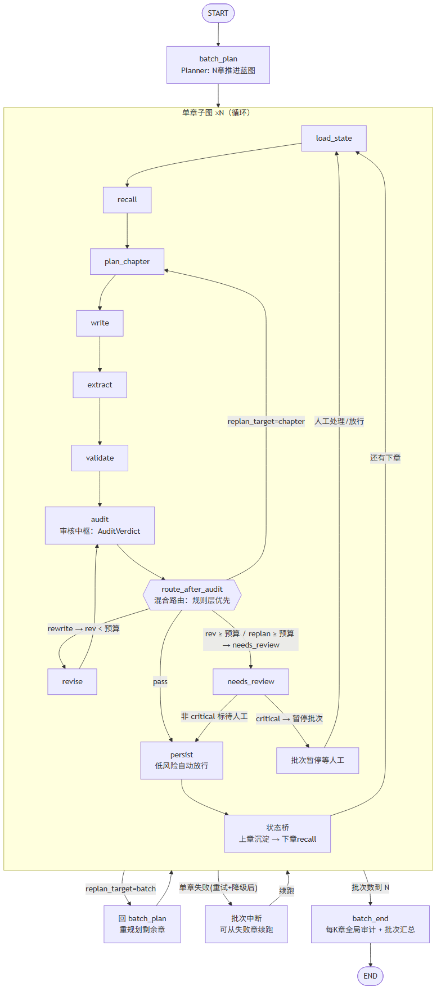
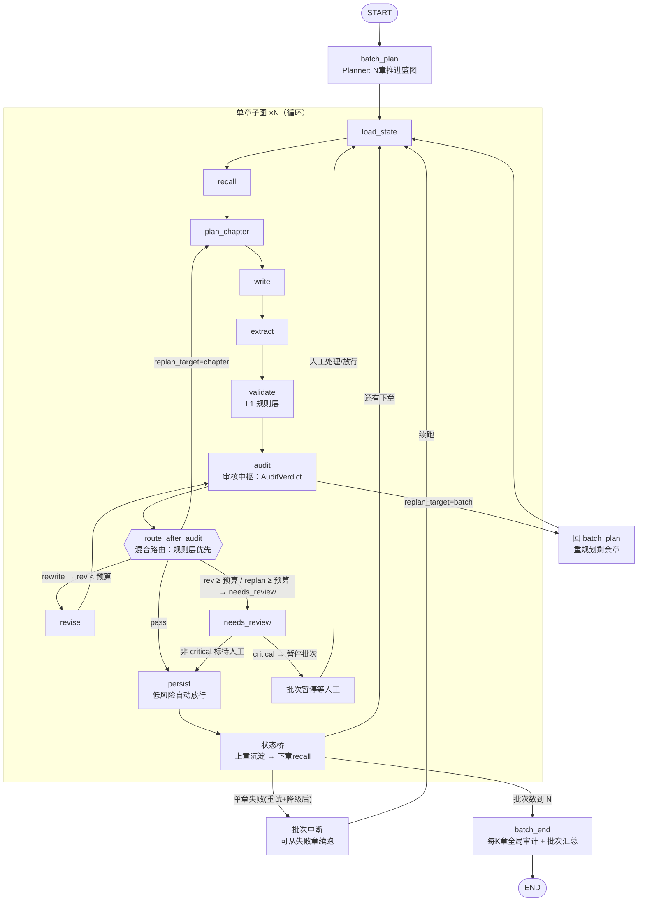

# Ai Ink 批量自动写作状态流转图 — Phase 0

> **用途**：LangGraph 工作流（plan.md §6.3）的运行蓝图 + 节点契约 + 异常分支。实现阶段 1 时本图直接变为代码骨架：节点函数、`ChapterState` / `BatchState` TypedDict、条件路由函数 `route_after_validation`。
>
> **配套**：数据契约见 `spec/schema.md`；评测样例见 `spec/conflict-samples.md`；批量设计见 plan.md §6.11，失败兜底见 §6.12。

## 1. 图拓扑（两级：批次主图 + 单章子图）



> 上图由 `state-flow.mmd`（可编辑源文件）渲染生成；Mermaid 源码保持内联以便在 GitHub / VSCode 直接预览。



## 2. 节点契约

> 节点间传**结构化对象**（plan.md §6.4），不传不断变长的自然语言 Prompt。类型 = 确定性节点（纯代码）/ LLM Agent / 角色。**LLM agent 不持任何工具**（§6.2 数据流边界），工具集中在确定性节点。

| 节点 | 层级 | 类型 | 输入 | 输出 / 副作用 | 用到的工具 |
|---|---|---|---|---|---|
| `batch_plan` | 批次 | Planner（LLM） | 当前大纲 / 剧情线 / 伏笔状态 + N | `BatchPlan`：N 章推进蓝图（每章推进目标 / 收伏笔 / 大纲推进段） | `get_plot_status` |
| `load_state` | 章 | 确定性 | 任务参数（project_id、chapter_seq） | 项目设定、章节计划、前情摘要初始化 | — |
| `recall` | 章 | 确定性 | 设定 + 前情 | `RetrievedContext`（分层召回 + token 预算） | `search_world_facts` / `search_plot_events` / `get_entity_relations` / `get_chapter_context` |
| `plan_chapter` | 章 | Planner（LLM） | `RetrievedContext` + 本章在 BatchPlan 的目标 | `ChapterPlan` | — |
| `write` | 章 | Writer（LLM） | `RetrievedContext` + `ChapterPlan` | `draft`（章节草稿） | — |
| `extract` | 章 | Memory（LLM） | `draft` + `ChapterPlan` | `MutationCandidate[]` 写入待确认池（自动模式：低风险自动放行，§6.11） | `save_memory_candidates` |
| `validate` | 章 | 确定性（L1 规则层） | `draft` + 图谱/事件/事实 + extract 候选 | `ValidationReport`（L1 硬证据，不被 LLM 绕过） | `check_constraints` |
| `audit` | 章 | **审核中枢 Audit（LLM，第 4 类 agent）** | `draft` + ChapterPlan + 召回上下文 + extract 候选 | `AuditVerdict`：pass / rewrite / replan + L2 findings + reasons + confidence | — |
| `revise` | 章 | 角色（复用 Writer 模型） | `draft` + Audit unresolved findings | 修订后 `draft` + 逐条 `fixed/cannot_fix/dispute` | — |
| `persist` | 章 | 确定性（编排层） | 确认候选 / 自动放行候选 | 事件/事实/状态/关系/伏笔落库（追加式）；`update_plot_threads` 推进大纲 | `save_chapter` / `save_*` / `update_plot_threads` |
| `状态桥` | 章间 | 确定性 | 上章 persist 结果 | 上章沉淀 → 下一章 recall 输入（连续推进） | — |
| `batch_end` | 批次 | 确定性 | 批次全部章节 | 每 K 章全局审计（§8.6）+ 批次汇总报告 | `commit_batch` |

## 3. 条件路由逻辑

```text
# 章内路由（单章子图）——混合路由（2026-08-07 确认）：规则层优先，LLM 兜语义
route_after_audit(state):
  # ① 规则层（不看 verdict，LLM 不能绕过硬约束）
  if L1 report 存在 critical:
      return "needs_review" if 预算用尽 else "revise"   # critical 强制修订/转人工
  if revision_count >= max_revisions or replan_count >= max_replans:
      return "needs_review"     # 预算用尽 → 转人工，不无限循环
  # ② LLM 语义层（采纳 AuditVerdict）
  match state.audit_verdict.verdict:
    "pass"    -> return "persist"
    "rewrite" -> return "revise"                        # 修订循环
    "replan"  -> return "replan_chapter" if verdict.replan_target=="chapter"
                                          else "replan_batch"  # 单章重规划 / 整批重规划

# 批次路由（单章结束后）
route_after_chapter(batch):
  if 本章 audit 判 replan_target=batch:
      return "replan_batch"     # 回 batch_plan 重规划剩余章（蓝图走偏，§6.11）
  if 本章 critical 冲突未解决:
      return "batch_paused"     # 暂停批次等人工（§6.11，已确认）
  if 本章重试+降级后仍失败:
      raise BatchChapterError    # 中断批次，可从失败章续跑（§6.11/§6.12，已确认）
  if batch.position < batch.size:
      return "next_chapter"     # 状态桥 → 下一章
  return "batch_done"           # 批次收尾

# 机制说明（2026-08-07 落地）：章失败抛 BatchChapterError 而非优雅返回 batch_failed——
# LangGraph 只在图未达 END 时支持同 thread 再 invoke 从断点续跑；优雅走到 batch_end
# 图已 END、续跑会从头重跑整批。抛异常使 batch 线程 checkpoint 停在 chapter 节点
# （position 未推进），续跑从失败章继续、不重跑已完成章。runner.generate_batch
# catch 后置任务 failed；resume_thread 以 checkpoint 状态为基座续跑。
```

- 条件路由是**纯函数**，不在节点内部自由跳转——可观测、可测试；语义建议由 Audit 提供，规则只兜硬约束与预算（§6.11 混合路由）；
- `max_revisions = 2`（rewrite）/ `max_replans = 1`（replan）；同一 `conflict_key` 跨修订轮稳定，去重不计入轮次。

## 4. 修订循环契约（审核中枢驱动）

- **触发源**：`audit` 的 verdict=rewrite（不是校验报告直接触发）——Audit 输出 L2 findings + 建议 → revise 逐条修；
- findings 每项带**冲突作用域**（`scope`）：`local`（段落级，预算 1 轮） / `structural`（整章，预算 2 轮）；
- revise 注入 unresolved findings，要求**逐条结构化响应**（`fixed / cannot_fix / dispute`）+ 修订后草稿；
- 每条 finding 的"生死"（提出 → 修复 → 复验）落 `finding_status`；
- **修订超预算 → needs_review**：非 critical 标记待人工、批次继续；critical 暂停批次等人工（§6.11）。

## 5. 异常分支与兜底（三层，plan.md §6.12）

| 场景 | 层 | 处理 |
|---|---|---|
| LLM 调用失败 / 超时 / 限流 | 调用层 | 指数退避重试（1s/2s/4s，上限 3 次）→ 模型降级链（主→备→默认）→ 思考模式超时降非思考 |
| 结构化输出解析失败 | 调用层 | 带"必须为 JSON"重试一次；仍失败 → 节点报错走任务层 |
| 输出超限被截断 | 调用层 | 检测截断标记 → 重生成尾部（前文摘要 + 剩余目标），不让截断章落库 |
| 单节点异常 | 任务层 | `stage_log` 记录错误 → 节点失败；批次中断（若该章重试+降级后仍失败） |
| 重复投递 | 任务层 | `task_id` 幂等键 + DB 唯一约束，只执行一次 |
| 批次中断 / 服务重启 / 人工暂停 | 任务层 | Checkpointer 断点续跑（`thread_id = batch_task_id`），从失败章续跑，不重跑已完成章 |
| 校验不收敛（≥2 轮仍有 unresolved） | 任务层 | needs_review 转人工；非 critical 批次继续，critical 批次暂停 |
| 抽取坏数据（Pydantic 校验失败） | 数据层 | **拒绝但不崩**：结构化 JSON + Pydantic 强校验，坏候选标记无效不落库 |
| 并发写 | 数据层 | 项目级"记忆沉淀锁"（Redis SETNX）+ 乐观版本号；顺序固定：落章节 → 沉淀记忆 → 更新状态（§7.6） |
| 半写 / 重放 | 数据层 | 单章一个事务；persist 幂等（`conflict_key` / 唯一约束），重放不重复落库 |
| 长线问题（战力通胀/人设漂移等） | 批次收尾 | 不阻塞本章——batch_end 每 K 章周期审计输出全局审计报告（§8.6） |

## 6. 与 5 类 Agent 的映射

```text
确定性节点（非 LLM）：load_state / recall / validate（L1 规则层）/ persist / 状态桥 / batch_end
LLM Agent：batch_plan + plan_chapter(Planner) / write(Writer) / extract(Memory) / audit(审核中枢 Audit)
角色（非独立 agent）：revise —— 复用 Writer 模型，与 Audit 分离保证审核报告纯净可审计
```

> 审核路由边界（§6.11 混合路由）：Audit 输出 AuditVerdict 做语义路由（pass/rewrite/replan），但 L1 critical 与轮次预算由确定性规则强制——Audit 不能绕过硬约束，也不能无限重写。

> 能力边界（plan.md §6.2）：写作/规划/校验 agent 只拿组装好的上下文，**没有任何 agent 直接写库**；写状态经 extract 出候选，编排层（persist）确认或自动放行后落库。
> 工具调用方式（plan.md §10）：阶段 1 工具是确定性节点内 Python 函数；阶段 3 封装 MCP server 跨服务复用；function calling 保留为 P1 agent 主动查证演进。
